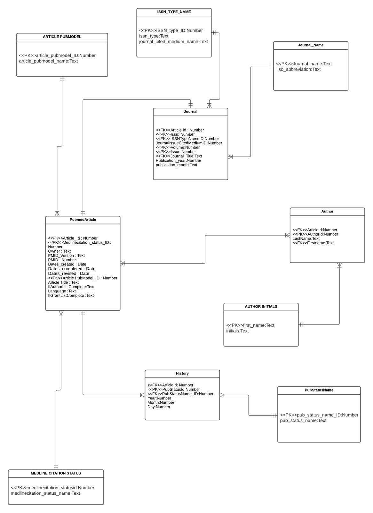

Importing the libraries
```{r}
library(XML)
library(tidyverse)
library(lubridate)
library(magrittr)
library(RSQLite)
library(sqldf)
library(ggplot2)
```


----------------------------------------------------------------------------------------------------------PART 1 ---------------------------------------------------------------------------------------------


When running the program please make sure to change the path or else the program will throw an error. 
```{r}
path <- "D://Northeastern\ University//CS5200\ DBMS//Practicum/Practicum\ 2/"
#path<- "C://Users/spati/OneDrive/Documents/practicum 2/"
xmlFile <- "pubmed_sample.xml"
fp <- paste0(path,xmlFile)
```

```{r}
# Reading the XML file and parse into DOM
xmlDOM <- xmlParse(file = fp)

# get the root node of the DOM tree
root <- xmlRoot(xmlDOM)
```

```{r}
# get number of children of root (number of purchase orders)
numPO <- xmlSize(root)
#numPO
```


1. (5 pts) Create a normalized relational schema that contains minimally the following entities: Article, Journal, Author, History. Use the XML document to determine the appropriate attributes (fields/columns) for the entities (tables). While there may be other types of publications in the XML, you only need to deal with articles in journals. Create appropriate primary and foreign keys. Where necessary, add surrogate keys. Include an image of an ERD showing your model in your R Notebook.


```{r pressure, echo=FALSE, fig.cap="A caption", out.width = '80%'}



```

ASSUMPTIONS :

1. We have assumed each author when they publish an article to have a different author ID. So even if they have the same name and if they have published different articles they get an unique author_ID. We had also concatenated the first name and the last name to another column full_name in the author table. One article can be written by many authors and many authors can write one article. It has many to many relationship with the article table.
2. We have seen from the data that initials is only dependent on the first name thus we have assumed that if we are given a first name we can get it's initials that is being used on the article paper. We have a seperate table for the lookup of initials called as author_initials.
3. We have assumed every record of history of every article will have an unique pubstatus_id to consider as a different record. We also have a lookup table to find out which type of publication status it belongs to. Every article will be having many history of publishing thus it has one to many relationship with history table.
4. In our journal we have assumed that each article from the given database gets a different journal to publish in. The primary key hence for the journal table is ISSN,ISSUE,VOLUME as even if an article gets to publish in the journal with the same issn as other journal it would be published in a different issue and different volume.  
5. We have a different lookup table to give the type of the ISSN and citation medium for our journals.


2. (5 pts) Realize the relational schema in SQLite (place the CREATE TABLE statements into SQL chunks in your R Notebook).


## Creating Database
```{r}

fpath = "D://Northeastern\ University//CS5200\ DBMS//Practicum/Practicum\ 2/"
#fpath <- "C://Users/spati/OneDrive/Documents/practicum 2/"
dbfile = "practicum_2.db"

# if database file already exists, we connect to it, otherwise
# we create a new database
dbcon <- dbConnect(RSQLite::SQLite(), paste0(fpath,dbfile))

```
                          
## Creating the tables to load the dataframe

```{sql connection=dbcon}
DROP TABLE author;
```

```{sql connection=dbcon}
DROP TABLE history;
```

```{sql connection=dbcon}
DROP TABLE journal;
```

```{sql connection=dbcon}
DROP TABLE pubmed_article;
```

```{sql connection=dbcon}
DROP TABLE medline_citation;
```

```{sql connection=dbcon}
DROP TABLE article_pubmodel;
```

```{sql connection=dbcon}
DROP TABLE journal_name;
```

```{sql connection=dbcon}
DROP TABLE issn_type_name;
```

```{sql connection=dbcon}
DROP TABLE pubstatus_name;
```

```{sql connection=dbcon}
DROP TABLE author_initials;
```

```{sql connection=dbcon}
DROP TABLE transaction_fact_table;
```

```{sql connection=dbcon}
CREATE TABLE pubmed_article(article_id INT,
                          medlinecitation_statusid VARCHAR(300),
                          owner VARCHAR(300),
                          pmid_version VARCHAR(300),
                          pmid INT,
                          dates_created VARCHAR(300),
                          dates_completed VARCHAR(300),
                          dates_revised VARCHAR(300),
                          article_pubmodel_id INT,
                          article_title VARCHAR(300),
                          if_author_list_complete VARCHAR(300),
                          language VARCHAR(300),
                          if_grant_list_completed VARCHAR(300)
);
```

```{sql connection=dbcon}
CREATE TABLE medline_citation(
  medlinecitation_statusid INT,
  medlinecitation_status_name VARCHAR(300)
);
```

```{sql connection=dbcon}
CREATE TABLE article_pubmodel(
  article_pubmodel_ID INT,
  article_pubmodel_name VARCHAR(300)
);
```

```{sql connection=dbcon}
CREATE TABLE journal(
                      article_id INT,
                          issn VARCHAR(300),
                          issn_type_name VARCHAR(300),
                          journal_issue_cited_medium VARCHAR(300),
                          volume VARCHAR(300),
                          issue VARCHAR(300),
                          Journal_title VARCHAR(300),
                          publication_year VARCHAR(300),
                          publication_month VARCHAR(300)
);
```

```{sql connection=dbcon}
CREATE TABLE journal_name(
        journal_name VARCHAR(300),
        iso_abbreviation VARCHAR(300)
);
```

```{sql connection=dbcon}
CREATE TABLE issn_type_name(
        issn_type_id INT,
        issn_type VARCHAR(300),
        journal_cited_medium_name VARCHAR(300)
);
```

```{sql connection=dbcon}
CREATE TABLE author(
        article_id INT,
        author_id INT,
        last_name VARCHAR(300),
        first_name VARCHAR(300),
        full_name VARCHAR(600)
);
```

```{sql connection=dbcon}
CREATE TABLE author_initials(
        first_name VARCHAR(300),
        initials VARCHAR(300)
);
```

```{sql connection=dbcon}
CREATE TABLE history(
        article_id INT,
        pubstatus_id VARCHAR(300),
        pubstatus_name_id VARCHAR(300),
        year VARCHAR(300),
        month INT,
        day INT
);
```

```{sql connection=dbcon}
CREATE TABLE pubstatus_name(
        pub_status_name_id INT,
        pub_status_name VARCHAR(300)
);
```

3. (30 pts) Extract and transform the data from the XML and then load into the appropriate tables in the database. You cannot (directly and solely) use xmlToDataFrame but instead must parse the XML node by node using a combination of node-by-node tree traversal and XPath. It is not feasible to use XPath to extract all journals, then all authors, etc. as some are missing and won't match up. You will need to iterate through the top-level nodes. While outside the scope of the course, this task could also be done through XSLT.


# Defining all the dataframes
```{r}
pubmed_article.df <- data.frame (article_id = integer(),
                          medlinecitation_statusid = integer(),
                          owner = character(),
                          pmid_version = character(),
                          pmid = integer(),
                          dates_created = character(),
                          dates_completed = character(),
                          dates_revised = character(),
                          article_pubmodel_ID = integer(),
                          article_title = character(),
                          if_author_list_complete= character(),
                          language = character(),
                          if_grant_list_completed = character(),
                          stringsAsFactors = FALSE) 

medline_citation.df <- data.frame(medlinecitation_statusid= integer(),
                                  medlinecitation_status_name = character(),
                                  stringsAsFactors = FALSE)

article_pubmodel.df <- data.frame(article_pubmodel_ID = integer(),
                                  article_pubmodel_name= character(),
                                  stringsAsFactors = FALSE)
                                  


journal.df <- data.frame (article_id = integer(),
                          issn = character(),
                          issn_type_name = character(),
                          journal_issue_cited_medium = character(),
                          volume = character(),
                          issue = character(),
                          Journal_title = character(),
                          #iso_abbreviation = character(),
                          publication_year=character(),
                          publication_month=character(),
                          stringsAsFactors = FALSE)

journal_name.df <- data.frame(Journal_name = character(),
                          iso_abbreviation = character(),
                          stringsAsFactors = FALSE)


issn_type_name.df <- data.frame(issn_type_id = integer(),
                                issn_type = character(),
                                journal_cited_medium_name=character(),
                                stringsAsFactors = FALSE)

author.df <- data.frame (article_id = integer(),
                          author_id = integer(),
                          last_name = character(),
                          first_name = character(),
                          #initials = character(),
                          stringsAsFactors = FALSE)

author_initials.df <- data.frame (
                          first_name = character(),
                          initials = character(),
                          stringsAsFactors = FALSE)


history.df <- data.frame (article_id = integer(),
                          pubstatus_id = integer(),
                          pubstatus_name_id = integer(),
                          year=integer(),
                          month = integer(),
                          day = integer(),
                          stringsAsFactors = FALSE)

pubstatus_name.df<- data.frame(pub_status_name_id = integer(),
                               pub_status_name = character(),
                               stringsAsFactors = FALSE)


```

------------------------------------------------PubmedArticle  Table-------------------------------------

```{r}

numPO=19

#7 17 --- has dates problem

for (m in 1:numPO){
  
  #print(m)
  
  node <- root[[m]]
  
  # Getting data from pubmed_article
  pubmed_article <- node[[1]]
  
  #Getting Medline Status 
  
  medlinecitation_status <- xmlAttrs(pubmed_article)

  m_medlinecitation_status<- medlinecitation_status[[2]]
  
  if(m_medlinecitation_status=="PubMed-not-MEDLINE")
  {
    m_medlinecitation_status=as.integer(1)
  }
  if(m_medlinecitation_status=="MEDLINE")
  {
    m_medlinecitation_status=as.integer(2)
  }
  #getting article pubmodel
  
  xpathEx00 <-"//MedlineCitation/Article"
  
  m_articlepubmodeltitle <- xpathSApply(pubmed_article,xpathEx00,xmlAttrs)
  m_pubmodel_name<- m_articlepubmodeltitle[[m]]
  
  if(m_pubmodel_name=="Print-Electronic")
  {
    m_pubmodel_name=as.integer(1)
  }
  if(m_pubmodel_name=="Print")
  {
    m_pubmodel_name=as.integer(2)
  }
  
  
  
  #Getting pmid and it's version
  m_pmid <- xmlValue(pubmed_article[[1]][[1]])
  b0 <- xmlAttrs(pubmed_article[[1]])
  m_pmid_version<-b0[[1]]
  
  # Getting date created
  date_created_year <- xmlValue(pubmed_article[[2]][[1]][[1]])
  
  
  date_created_month <- xmlValue(pubmed_article[[2]][[2]][[1]])
  
  date_created_day <- xmlValue(pubmed_article[[2]][[3]][[1]])
  
  m_date_created <- paste(date_created_year, date_created_month, date_created_day, sep="-") %>% ymd() %>% as.Date()
  
  strDates1 <- as.character(m_date_created)

  
  #Getting Date Completed
  date_completed_year <- xmlValue(pubmed_article[[3]][[1]][[1]])

  
  date_completed_month <- xmlValue(pubmed_article[[3]][[2]][[1]])

  
  date_completed_day <- xmlValue(pubmed_article[[3]][[3]][[1]])

  
  m_date_completed <- paste(date_completed_year, date_completed_month, date_completed_day, sep="-") %>% ymd() %>% as.Date()
  
  strDates2 <- as.character(m_date_completed)
  


  #Getting Date Revised
  
  date_revised_year <- xmlValue(pubmed_article[[4]][[1]][[1]])

  
  date_revised_month <- xmlValue(pubmed_article[[4]][[2]][[1]])

  
  date_revised_day <- xmlValue(pubmed_article[[4]][[3]][[1]])

  
  m_date_revised <- paste(date_revised_year, date_revised_month, date_revised_day, sep="-") %>% ymd() %>% as.Date()
  
  strDates3 <- as.character(m_date_revised)
  
  #Getting article_title
  
  

  xpathEx0 <-"//MedlineCitation/Article/ArticleTitle"
  
  m_articletitle <- xpathSApply(pubmed_article,xpathEx0,xmlValue)
  m_article_title<- m_articletitle[[m]]

  #Getting AuthorListComplete
  
  xpathEx1 <-"//MedlineCitation/Article/AuthorList"


  x1<-xpathSApply(pubmed_article,xpathEx1,xmlAttrs)
 
  m_authorlist_ifcomplete <- x1[[1]]
  
  #getting language
  
  xpathEx2 <-"//MedlineCitation/Article/Language"
  
  x2 <- xpathSApply(pubmed_article,xpathEx2,xmlValue)
  m_language <- x2[[1]]

  #Checking if grant is completed
  xpathEx3 <-"//MedlineCitation/Article/GrantList"


  x3<-xpathSApply(pubmed_article,xpathEx3,xmlAttrs)
  m_grantlist_ifcomplete <- x3[[1]]

  ## Article Date Completed
  
  #assigning randomm values
  m_article_id = as.integer(m)
  m_owner <- "NLM"

  #Getting the Pubmodel_article dataframe
  pubmed_article.df[m,1] <- m_article_id   #primary key
  pubmed_article.df[m,2] <- m_medlinecitation_status
  pubmed_article.df[m,3] <- m_owner
  pubmed_article.df[m,4] <- m_pmid_version
  pubmed_article.df[m,5] <- m_pmid
  pubmed_article.df[m,6] <- strDates1
  pubmed_article.df[m,7] <- strDates2
  pubmed_article.df[m,8] <- strDates3
  pubmed_article.df[m,9] <- m_pubmodel_name
  pubmed_article.df[m,10] <-m_article_title
  pubmed_article.df[m,11] <-m_authorlist_ifcomplete
  pubmed_article.df[m,12] <-m_language
  pubmed_article.df[m,13] <-m_grantlist_ifcomplete
} 
row.names(pubmed_article.df) <- NULL


#print(pubmed_article.df)

  
``` 


---------------------------------------------------------------------JOURNAL TABLE------------------------------------------------------------------

```{r}
noPO=19

for(m in 1:noPO){
  
node<- root[[m]]

pubmed_article <- node[[1]]

#getting ISSN nO
xpathjournal1 <-"//MedlineCitation/Article/Journal/ISSN"
  
issn_no<- xpathSApply(pubmed_article,xpathjournal1,xmlValue)
j_issn_no<- issn_no[[m]]

#print(m)
#print(j_issn_no)

#getting ISSN TYPE
xpathjournal2 <-"//MedlineCitation/Article/Journal/ISSN"
  
issn_no_type<- xpathSApply(pubmed_article,xpathjournal2,xmlAttrs)
j_issn_no_type<- issn_no_type[[m]]

if(j_issn_no_type=="Print")
{
  j_issn_no_type=as.integer(1)
}
if(j_issn_no_type=="Electronic")
{
  j_issn_no_type=as.integer(2)
}


#Getting issue medium
xpathjournal3 <-"//MedlineCitation/Article/Journal/JournalIssue"
  
issn_no_issue<- xpathSApply(pubmed_article,xpathjournal3,xmlAttrs)
j_issn_issue<- issn_no_issue[[m]]


if(j_issn_issue=="Print")
{
  j_issn_issue=as.integer(1)
}
if(j_issn_issue=="Internet")
{
  j_issn_issue=as.integer(2)
}


#getting volume of Journal

xpathjournal4 <-"//MedlineCitation/Article/Journal/JournalIssue/Volume"
  
issn_volume_type<- xpathSApply(pubmed_article,xpathjournal4,xmlValue)
j_issn_volume<- issn_volume_type[[m]]

#Getting issue of Journal

xpathjournal5 <-"//MedlineCitation/Article/Journal/JournalIssue/Issue"
  
issn_no_issues<- xpathSApply(pubmed_article,xpathjournal5,xmlValue)
j_issn_no_issue<- issn_no_issues[[m]]

#getting title
xpathjournal6 <-"//MedlineCitation/Article/Journal/Title"
  
issn_no_title<- xpathSApply(pubmed_article,xpathjournal6,xmlValue)
j_issn_no_title<- issn_no_title[[m]]

#getting ISOAbbreviation
xpathjournal7 <-"//MedlineCitation/Article/Journal/ISOAbbreviation"
  
issn_no_iso<- xpathSApply(pubmed_article,xpathjournal7,xmlValue)
j_issn_no_ISOAbbreviation<- issn_no_iso[[m]]

m_article_id = as.integer(m)

#Getting pub year of the Journal
xpathEx_year <-"//MedlineCitation/Article/Journal/JournalIssue/PubDate/MedlineDate|//MedlineCitation/Article/Journal/JournalIssue/PubDate/Year"
    
m_year <- xpathSApply(pubmed_article,xpathEx_year,xmlValue)
trystring_year<-m_year[[m]]

returnstring_year<-str_split(trystring_year," ")

  
j_final_year<-returnstring_year[[1]][[1]]

#Getting pub month of the Journal

xpathEx_month <-"//MedlineCitation/Article/Journal/JournalIssue/PubDate/MedlineDate|//MedlineCitation/Article/Journal/JournalIssue/PubDate/Month"
  
m_year_m <- xpathSApply(pubmed_article,xpathEx_month,xmlValue)

i=19
while(i>=12)
{
  m_year_m[[i]]<-m_year_m[[i-1]]
  i <- i-1
}

m_year_m[[12]]<-"Jun"


#print(typeof(m_year))
trystring_year_m<-m_year_m[[m]]
returnstring_year_m<-str_split(trystring_year_m," ")
#print(returnstring_year[[1]][[1]])

if(returnstring_year_m[[1]][[1]]=="2012" | returnstring_year_m[[1]][[1]]=="2013")
{
  month<-returnstring_year_m[[1]][[2]]
  month<-str_split(month,"-")
  final_month<-month[[1]][[1]]
  #print(final_month)
  #print(m)
}

if(m==12)
{
  final_month <- "Jun"
  #print(final_month)
  #print(m)
}

else if(m!=2 & m!=4 & m!=12 & m!=13 & m!=18)
{
  final_month <- returnstring_year_m[[1]][[1]]
  

  
}


##Loading the dataframe 

journal.df[m,1] <- m_article_id # foreign key
journal.df[m,2] <- j_issn_no     #primary key
journal.df[m,3] <- j_issn_no_type
journal.df[m,4] <- j_issn_issue
journal.df[m,5] <- j_issn_volume
journal.df[m,6] <- j_issn_no_issue
journal.df[m,7] <- j_issn_no_title
#journal.df[m,8] <- j_issn_no_ISOAbbreviation
journal.df[m,8] <- j_final_year
journal.df[m,9] <- final_month

}
row.names(journal.df) <- NULL
#print(journal.df)


```


--------------------------------------------------------------------------------------------------JOURNAL NAME AND ABBREVIATION------------------------------------------------------------------------------------------


```{r}

noPO=19

for(m in 1:noPO){
  
node<- root[[m]]

pubmed_article <- node[[1]]

#getting title
xpathjournal6 <-"//MedlineCitation/Article/Journal/Title"
  
issn_no_title<- xpathSApply(pubmed_article,xpathjournal6,xmlValue)
j_issn_no_title<- issn_no_title[[m]]

#getting ISOAbbreviation
xpathjournal7 <-"//MedlineCitation/Article/Journal/ISOAbbreviation"
  
issn_no_iso<- xpathSApply(pubmed_article,xpathjournal7,xmlValue)
j_issn_no_ISOAbbreviation<- issn_no_iso[[m]]

journal_name.df[m,1] <- j_issn_no_title
journal_name.df[m,2] <- j_issn_no_ISOAbbreviation

}

journal_name.df<-journal_name.df[!duplicated(journal_name.df$Journal_name), ]
row.names(journal_name.df) <- NULL
#print(journal_name.df)


```

----------------------------------------------------------------------------------------------------------ISSN TYPE NAME---------------------------------------------------------------------------------------------------


```{r}
issn_type_name.df[1,1] <- as.integer(1)

issn_type_name.df[1,2] <- "Print"

issn_type_name.df[1,3] <- "Print"

issn_type_name.df[2,1] <- as.integer(2)

issn_type_name.df[2,2] <- "Electronic"

issn_type_name.df[2,3] <- "Internet"

row.names(issn_type_name.df) <- NULL

#print(issn_type_name.df)


```


---------------------------------------------------------------------------------------HISTORY TABLE-------------------------------------------------------------------------------

```{r}

noPO<-19
sum<-1
for(m in 1:noPO)
{

  node <- root[[m]]
  pubmeddata_node<-node[[2]]
  
  vals<-pubmeddata_node[[1]]
  
  xpathjournal1 <-"count(./PubMedPubDate)"
  
  year<- xpathSApply(vals,xpathjournal1,xmlValue)
  

  
  publication_status <- "./PubMedPubDate"
  
  publication_status_final <- xpathSApply(vals,publication_status,xmlAttrs)
  

  
  publication_year_history <- "./PubMedPubDate/Year"
  
  publication_year_history_final <- xpathSApply(vals,publication_year_history,xmlValue)
  

  publication_month_history <- "./PubMedPubDate/Month"
  
  publication_month_history_final <- xpathSApply(vals,publication_month_history,xmlValue)
  

  
  
  publication_day_history <- "./PubMedPubDate/Day"
  
  publication_day_history_final <- xpathSApply(vals,publication_day_history,xmlValue)
  

  
  
  for (i in 1:year)
  {
  
    h_status_final<- publication_status_final[[i]][[1]]
    if(h_status_final=="received")
    {
      h_status_final <- as.integer(1)
    }
    
    if(h_status_final=="accepted")
    {
      h_status_final <- as.integer(2)
    }
    if(h_status_final=="epublish")
    {
      h_status_final <- as.integer(3)
    }
    if(h_status_final=="entrez")
    {
      h_status_final <- as.integer(4)
    }
    if(h_status_final=="pubmed")
    {
      h_status_final <- as.integer(5)
    }
    if(h_status_final=="medline")
    {
      h_status_final <- as.integer(6)
    }
    if(h_status_final=="revised")
    {
      h_status_final <- as.integer(7)
    }
    if(h_status_final=="aheadofprint")
    {
      h_status_final <- as.integer(8)
    }
    
    h_year_final<-publication_year_history_final[[i]][[1]]
    h_month_final<-publication_month_history_final[[i]][[1]]
    h_day_final<-publication_day_history_final[[i]][[1]]
    history.df[sum,1] <- as.integer(m)
    history.df[sum,2] <- as.integer(sum)
    history.df[sum,3] <- h_status_final
    history.df[sum,4] <- h_year_final
    history.df[sum,5] <- h_month_final
    history.df[sum,6] <- h_day_final
    sum<-sum+1
  }


}
row.names(history.df) <- NULL
#print(history.df)


```

-----------------------------------------------------------------------------PUB STATUS NAME---------------------------------------------

```{R}

pubstatus_name.df[1,1]<-as.integer(1)
pubstatus_name.df[1,2]<-"received"
pubstatus_name.df[2,1]<-as.integer(2)
pubstatus_name.df[2,2]<-"accepted"
pubstatus_name.df[3,1]<-as.integer(3)
pubstatus_name.df[3,2]<-"epublish"
pubstatus_name.df[4,1]<-as.integer(4)
pubstatus_name.df[4,2]<-"entrez"
pubstatus_name.df[5,1]<-as.integer(5)
pubstatus_name.df[5,2]<-"pubmed"
pubstatus_name.df[6,1]<-as.integer(6)
pubstatus_name.df[6,2]<-"medline"
pubstatus_name.df[7,1]<-as.integer(7)
pubstatus_name.df[7,2]<-"revised"
pubstatus_name.df[8,1]<-as.integer(8)
pubstatus_name.df[8,2]<-"aheadofprint"

row.names(pubstatus_name.df) <- NULL
#print(pubstatus_name.df)


```


-----------------------------------------------------------------------------AUTHOR TABLE-------------------------------------------------------------------

```{r}
summ=1;

for(m in 1:19)
{
  

  node <- root[[m]]
  pubmeddata_node<-node[[1]]
  vals<-"count(./Article/AuthorList/Author)"
  
  no_of_children_authors<- xpathSApply(pubmeddata_node,vals,xmlChildren)

  lastname<-"./Article/AuthorList/Author/LastName"
  lastname_author<- xpathSApply(pubmeddata_node,lastname,xmlValue)

  
  forename<-"./Article/AuthorList/Author/ForeName"
  forename_author<- xpathSApply(pubmeddata_node,forename,xmlValue)

  
  initials<-"./Article/AuthorList/Author/Initials"
  initials_author<- xpathSApply(pubmeddata_node,initials,xmlValue)

  
  for(i in 1:no_of_children_authors)
  {
    
      author.df[summ,1]<-as.integer(m)
      author.df[summ,2]<-as.integer(summ)
      author.df[summ,3]<-lastname_author[[i]]
      author.df[summ,4]<-forename_author[[i]]
      #author.df[summ,5]<-initials_author[[i]]
      summ<-summ+1


    
    
  }
    
}

#author.df<-author.df[!duplicated(author.df$first_name)&!duplicated(author.df$last_name), ]
#author.df<-author.df[!duplicated(author.df[,c('last_name','first_name')]),]
author.df$full_name <- paste(author.df$first_name, author.df$last_name)

row.names(author.df) <- NULL
#print(author.df)


```

---------------------------------------------------------------------------AUTHOR INITIALS-------------------------------------------------------------------------------------------

```{r}
summ=1;

for(m in 1:19)
{
  

  node <- root[[m]]
  pubmeddata_node<-node[[1]]
  vals<-"count(./Article/AuthorList/Author)"
  
  no_of_children_authors<- xpathSApply(pubmeddata_node,vals,xmlChildren)


  
  forename<-"./Article/AuthorList/Author/ForeName"
  forename_author<- xpathSApply(pubmeddata_node,forename,xmlValue)

  
  initials<-"./Article/AuthorList/Author/Initials"
  initials_author<- xpathSApply(pubmeddata_node,initials,xmlValue)

  
  for(i in 1:no_of_children_authors)
  {
    
      
      author_initials.df[summ,1]<-forename_author[[i]]
      author_initials.df[summ,2]<-initials_author[[i]]
      summ<-summ+1


    
    
  }
    
}

author_initials.df<-author_initials.df[!duplicated(author_initials.df[,c('first_name')]),]
row.names(author_initials.df) <- NULL
#print(author_initials.df)


```


---------------------------------------------------------------------------------MEDLINE CITATION STATUS TABLE--------------------------------------------------------
```{r}
medline_citation.df[1,1]<-as.integer(1)
medline_citation.df[1,2]<-"PubMed-not-MEDLINE"
medline_citation.df[2,1]<-as.integer(2)
medline_citation.df[2,2]<-"MEDLINE"

row.names(medline_citation.df) <- NULL
#print(medline_citation.df)

```

-------------------------------------------------------------------------ARTICLE PUBMODEL-------------------------------------------------------------------------------------------------------
```{r}
article_pubmodel.df[1,1]<-as.integer(1)
article_pubmodel.df[1,2]<-"Print-Electronic"
article_pubmodel.df[2,1]<-as.integer(2)
article_pubmodel.df[2,2]<-"Print"

row.names(article_pubmodel.df) <- NULL
#print(article_pubmodel.df)

```


--------------------------------------------------Writing the above loaded dataframes to the database-----------------------------------------------------------------------------------------
                          
## Loading the DB Tables

```{r}
dbWriteTable(dbcon, name="pubmed_article", value=pubmed_article.df, append=TRUE)
```

```{sql connection=dbcon}
select * from pubmed_article limit 5;
```
```{r}
dbWriteTable(dbcon, name="medline_citation", value=medline_citation.df, append=TRUE)
```

```{sql connection=dbcon}
select * from medline_citation limit 5;
```

```{r}
dbWriteTable(dbcon, name="article_pubmodel", value=article_pubmodel.df, append=TRUE)
```

```{sql connection=dbcon}
select * from article_pubmodel limit 5;
```

```{r}
dbWriteTable(dbcon, name="journal", value=journal.df, append=TRUE)
```

```{sql connection=dbcon}
select * from journal limit 5;
```

```{r}
dbWriteTable(dbcon, name="journal_name", value=journal_name.df, append=TRUE)
```

```{sql connection=dbcon}
select * from journal_name limit 5;
```

```{r}
dbWriteTable(dbcon, name="issn_type_name", value=issn_type_name.df, append=TRUE)
```

```{sql connection=dbcon}
select * from issn_type_name limit 5;
```

```{r}
dbWriteTable(dbcon, name="author", value=author.df, append=TRUE)
```

```{sql connection=dbcon}
select * from author limit 5;
```

```{r}
dbWriteTable(dbcon, name="author_initials", value=author_initials.df, append=TRUE)
```

```{sql connection=dbcon}
select * from author_initials limit 5;
```

```{r}
dbWriteTable(dbcon, name="history", value=history.df, append=TRUE)
```

```{sql connection=dbcon}
select * from history limit 5;
```


--------------------------------------------------------------------------------------------PART 2 --------------------------------------------------------------------------------------


1. (20 pts) Create and populate a star schema with dimension and transaction fact tables. Each row in the fact table will represent one article. Include the image of an updated ERD that contains the fact table and any additional required dimension tables. Populate the star schema in R. When building the schema, look a head to Part 3 as the schema is dependent on the eventual OLAP queries.

```{R}

pubmed_article_star.df <- data.frame (article_id = integer(),
                          medlinecitation_statusid = character(),
                          owner = character(),
                          pmid_version = character(),
                          pmid = integer(),
                          dates_created = character(),
                          dates_completed = character(),
                          dates_revised = character(),
                          article_pubmodel = character(),
                          article_title = character(),
                          if_author_list_complete= character(),
                          language = character(),
                          if_grant_list_completed = character(),
                          stringsAsFactors = FALSE)  


journal_star.df <- data.frame (article_id = integer(),
                          issn = character(),
                          issn_type_name = character(),
                          journal_issue_cited_medium = character(),
                          volume = character(),
                          issue = character(),
                          Journal_title = character(),
                          iso_abbreviation = character(),
                          publication_year=character(),
                          publication_month=character(),
                          stringsAsFactors = FALSE)


author_star.df <- data.frame (article_id = integer(),
                          author_id = integer(),
                          last_name = character(),
                          first_name = character(),
                          initials = character(),
                          stringsAsFactors = FALSE
                          )

# grant.df <- data.frame (article_id = integer(),
#                           grant_id = character(),
#                           acronym = character(),
#                           agency = character(),
#                           country = character()
#                           )


history_star.df <- data.frame (article_id = integer(),
                          pubstatus_id = integer(),
                          pubstatus_name = character(),
                          year=integer(),
                          month = integer(),
                          day = integer(),
                          stringsAsFactors = FALSE)

```


As we have to populate the database for the star schema, we are removing all the lookup tables and including those columns in the dimensional table to make the dimensional table as denormalized. We are again parsing the xml and this time we are going to store it in the denormalized form so that when we write to the database it is in the denormalized form. After having the dimensional tables we will create a fact table consisting of the primary keys of the dimensional tables and the columns that we would be needing for the PART 3 Analysis.


--------------------------------------------------------------------------PubmedArticle dimensional DATAFRAME----------------------------------------------------------------------------------------------------

```{r}

numPO=19

#7 17 --- has dates problem

for (m in 1:numPO){
  
  #print(m)
  
  node <- root[[m]]
  
  # Getting data from pubmed_article
  pubmed_article <- node[[1]]
  
  #Getting Medline Status 
  
  medlinecitation_status <- xmlAttrs(pubmed_article)

  m_medlinecitation_status<- medlinecitation_status[[2]]
  
  #getting article pubmodel
  
  xpathEx00 <-"//MedlineCitation/Article"
  
  m_articlepubmodeltitle <- xpathSApply(pubmed_article,xpathEx00,xmlAttrs)
  m_pubmodel_name<- m_articlepubmodeltitle[[m]]
  
  #Getting pmid and it's version
  m_pmid <- xmlValue(pubmed_article[[1]][[1]])
  b0 <- xmlAttrs(pubmed_article[[1]])
  m_pmid_version<-b0[[1]]
  
  # Getting date created
  date_created_year <- xmlValue(pubmed_article[[2]][[1]][[1]])
  
  
  date_created_month <- xmlValue(pubmed_article[[2]][[2]][[1]])
  
  date_created_day <- xmlValue(pubmed_article[[2]][[3]][[1]])
  
  m_date_created <- paste(date_created_year, date_created_month, date_created_day, sep="-") %>% ymd() %>% as.Date()
  
  strDates1 <- as.character(m_date_created)

  
  #Getting Date Completed
  date_completed_year <- xmlValue(pubmed_article[[3]][[1]][[1]])

  
  date_completed_month <- xmlValue(pubmed_article[[3]][[2]][[1]])

  
  date_completed_day <- xmlValue(pubmed_article[[3]][[3]][[1]])

  
  m_date_completed <- paste(date_completed_year, date_completed_month, date_completed_day, sep="-") %>% ymd() %>% as.Date()
  
  strDates2 <- as.character(m_date_completed)
  


  #Getting Date Revised
  
  date_revised_year <- xmlValue(pubmed_article[[4]][[1]][[1]])

  
  date_revised_month <- xmlValue(pubmed_article[[4]][[2]][[1]])

  
  date_revised_day <- xmlValue(pubmed_article[[4]][[3]][[1]])

  
  m_date_revised <- paste(date_revised_year, date_revised_month, date_revised_day, sep="-") %>% ymd() %>% as.Date()
  
  strDates3 <- as.character(m_date_revised)
  
  #Getting article_title
  
  

  xpathEx0 <-"//MedlineCitation/Article/ArticleTitle"
  
  m_articletitle <- xpathSApply(pubmed_article,xpathEx0,xmlValue)
  m_article_title<- m_articletitle[[m]]

  #Getting AuthorListComplete
  
  xpathEx1 <-"//MedlineCitation/Article/AuthorList"


  x1<-xpathSApply(pubmed_article,xpathEx1,xmlAttrs)
 
  m_authorlist_ifcomplete <- x1[[1]]
  
  #getting language
  
  xpathEx2 <-"//MedlineCitation/Article/Language"
  
  x2 <- xpathSApply(pubmed_article,xpathEx2,xmlValue)
  m_language <- x2[[1]]

  #Checking if grant is completed
  xpathEx3 <-"//MedlineCitation/Article/GrantList"


  x3<-xpathSApply(pubmed_article,xpathEx3,xmlAttrs)
  m_grantlist_ifcomplete <- x3[[1]]

  ## Article Date Completed
  
  #assigning randomm values
  m_article_id = as.integer(m)
  m_owner <- "NLM"

  #Getting the Pubmodel_article dataframe
  pubmed_article_star.df[m,1] <- m_article_id   #primary key
  pubmed_article_star.df[m,2] <- m_medlinecitation_status
  pubmed_article_star.df[m,3] <- m_owner
  pubmed_article_star.df[m,4] <- m_pmid_version
  pubmed_article_star.df[m,5] <- m_pmid
  pubmed_article_star.df[m,6] <- strDates1
  pubmed_article_star.df[m,7] <- strDates2
  pubmed_article_star.df[m,8] <- strDates3
  pubmed_article_star.df[m,9] <- m_pubmodel_name
  pubmed_article_star.df[m,10] <-m_article_title
  pubmed_article_star.df[m,11] <-m_authorlist_ifcomplete
  pubmed_article_star.df[m,12] <-m_language
  pubmed_article_star.df[m,13] <-m_grantlist_ifcomplete
} 

#print(pubmed_article_star.df)

  
```


--------------------------------------------------------------JOURNAL dimensional DATAFRAME------------------------------------------------------------------

```{r}
noPO=19

for(m in 1:noPO){
  
node<- root[[m]]

pubmed_article <- node[[1]]

#getting ISSN nO
xpathjournal1 <-"//MedlineCitation/Article/Journal/ISSN"
  
issn_no<- xpathSApply(pubmed_article,xpathjournal1,xmlValue)
j_issn_no<- issn_no[[m]]

#print(m)
#print(j_issn_no)

#getting ISSN TYPE
xpathjournal2 <-"//MedlineCitation/Article/Journal/ISSN"
  
issn_no_type<- xpathSApply(pubmed_article,xpathjournal2,xmlAttrs)
j_issn_no_type<- issn_no_type[[m]]

#Getting issue medium
xpathjournal3 <-"//MedlineCitation/Article/Journal/JournalIssue"
  
issn_no_issue<- xpathSApply(pubmed_article,xpathjournal3,xmlAttrs)
j_issn_issue<- issn_no_issue[[m]]


#getting volume of Journal

xpathjournal4 <-"//MedlineCitation/Article/Journal/JournalIssue/Volume"
  
issn_volume_type<- xpathSApply(pubmed_article,xpathjournal4,xmlValue)
j_issn_volume<- issn_volume_type[[m]]

#Getting issue of Journal

xpathjournal5 <-"//MedlineCitation/Article/Journal/JournalIssue/Issue"
  
issn_no_issues<- xpathSApply(pubmed_article,xpathjournal5,xmlValue)
j_issn_no_issue<- issn_no_issues[[m]]

#getting title
xpathjournal6 <-"//MedlineCitation/Article/Journal/Title"
  
issn_no_title<- xpathSApply(pubmed_article,xpathjournal6,xmlValue)
j_issn_no_title<- issn_no_title[[m]]

#getting ISOAbbreviation
xpathjournal7 <-"//MedlineCitation/Article/Journal/ISOAbbreviation"
  
issn_no_iso<- xpathSApply(pubmed_article,xpathjournal7,xmlValue)
j_issn_no_ISOAbbreviation<- issn_no_iso[[m]]

m_article_id = as.integer(m)

#Getting pub year of the Journal
xpathEx_year <-"//MedlineCitation/Article/Journal/JournalIssue/PubDate/MedlineDate|//MedlineCitation/Article/Journal/JournalIssue/PubDate/Year"
    
m_year <- xpathSApply(pubmed_article,xpathEx_year,xmlValue)
trystring_year<-m_year[[m]]

returnstring_year<-str_split(trystring_year," ")

  
j_final_year<-returnstring_year[[1]][[1]]

#Getting pub month of the Journal

xpathEx_month <-"//MedlineCitation/Article/Journal/JournalIssue/PubDate/MedlineDate|//MedlineCitation/Article/Journal/JournalIssue/PubDate/Month"
  
m_year_m <- xpathSApply(pubmed_article,xpathEx_month,xmlValue)

i=19
while(i>=12)
{
  m_year_m[[i]]<-m_year_m[[i-1]]
  i <- i-1
}

m_year_m[[12]]<-"Jun"


#print(typeof(m_year))
trystring_year_m<-m_year_m[[m]]
returnstring_year_m<-str_split(trystring_year_m," ")
#print(returnstring_year[[1]][[1]])

if(returnstring_year_m[[1]][[1]]=="2012" | returnstring_year_m[[1]][[1]]=="2013")
{
  month<-returnstring_year_m[[1]][[2]]
  month<-str_split(month,"-")
  final_month<-month[[1]][[1]]
  #print(final_month)
  #print(m)
}

if(m==12)
{
  final_month <- "Jun"
  #print(final_month)
  #print(m)
}

else if(m!=2 & m!=4 & m!=12 & m!=13 & m!=18)
{
  final_month <- returnstring_year_m[[1]][[1]]
  
  #print(final_month)
  #print(m)
  
}


##Loading the dataframe 

journal_star.df[m,1] <- m_article_id # foreign key
journal_star.df[m,2] <- j_issn_no     #primary key
journal_star.df[m,3] <- j_issn_no_type
journal_star.df[m,4] <- j_issn_issue
journal_star.df[m,5] <- j_issn_volume
journal_star.df[m,6] <- j_issn_no_issue
journal_star.df[m,7] <- j_issn_no_title
journal_star.df[m,8] <- j_issn_no_ISOAbbreviation
journal_star.df[m,9] <- j_final_year
journal_star.df[m,10] <- final_month

}

#print(journal_star.df)


```

---------------------------------------------------------------HISTORY dimensional DATAFRAME-------------------------------------------------------------------------------

```{r}

noPO<-19
sum<-1
for(m in 1:noPO)
{

  node <- root[[m]]
  pubmeddata_node<-node[[2]]
  
  vals<-pubmeddata_node[[1]]
  
  xpathjournal1 <-"count(./PubMedPubDate)"
  
  year<- xpathSApply(vals,xpathjournal1,xmlValue)
  

  
  publication_status <- "./PubMedPubDate"
  
  publication_status_final <- xpathSApply(vals,publication_status,xmlAttrs)
  

  
  publication_year_history <- "./PubMedPubDate/Year"
  
  publication_year_history_final <- xpathSApply(vals,publication_year_history,xmlValue)
  

  publication_month_history <- "./PubMedPubDate/Month"
  
  publication_month_history_final <- xpathSApply(vals,publication_month_history,xmlValue)
  

  
  
  publication_day_history <- "./PubMedPubDate/Day"
  
  publication_day_history_final <- xpathSApply(vals,publication_day_history,xmlValue)
  

  
  
  for (i in 1:year)
  {
  
    h_status_final<- publication_status_final[[i]][[1]]
    h_year_final<-publication_year_history_final[[i]][[1]]
    h_month_final<-publication_month_history_final[[i]][[1]]
    h_day_final<-publication_day_history_final[[i]][[1]]
    history_star.df[sum,1] <- as.integer(m)
    history_star.df[sum,2] <- as.integer(sum)
    history_star.df[sum,3] <- h_status_final
    history_star.df[sum,4] <- h_year_final
    history_star.df[sum,5] <- h_month_final
    history_star.df[sum,6] <- h_day_final
    sum<-sum+1
  }


}

#print(history_star.df)


```

-----------------------------------------------------------------------------AUTHOR dimensional DATAFRAME-------------------------------------------------------------------

```{r}
summ=1;

for(m in 1:19)
{
  

  node <- root[[m]]
  pubmeddata_node<-node[[1]]
  vals<-"count(./Article/AuthorList/Author)"
  
  no_of_children_authors<- xpathSApply(pubmeddata_node,vals,xmlChildren)

  lastname<-"./Article/AuthorList/Author/LastName"
  lastname_author<- xpathSApply(pubmeddata_node,lastname,xmlValue)

  
  forename<-"./Article/AuthorList/Author/ForeName"
  forename_author<- xpathSApply(pubmeddata_node,forename,xmlValue)

  
  initials<-"./Article/AuthorList/Author/Initials"
  initials_author<- xpathSApply(pubmeddata_node,initials,xmlValue)

  
  for(i in 1:no_of_children_authors)
  {
    
      author_star.df[summ,1]<-as.integer(m)
      author_star.df[summ,2]<-as.integer(summ)
      author_star.df[summ,3]<-lastname_author[[i]]
      author_star.df[summ,4]<-forename_author[[i]]
      author_star.df[summ,5]<-initials_author[[i]]
      summ<-summ+1


    
    
  }
    
}

#author.df<-author.df[!duplicated(author.df$first_name)&!duplicated(author.df$first_name), ]
#print(author_star.df)


```

 Creating the database for the star schema

## Creating Database
```{r}

fpath = "D://Northeastern\ University//CS5200\ DBMS//Practicum/Practicum\ 2/"
#fpath <- "C://Users/spati/OneDrive/Documents/practicum 2/"
dbfile = "practicum_2.db"

# if database file already exists, we connect to it, otherwise
# we create a new database
dbcon <- dbConnect(RSQLite::SQLite(), paste0(fpath,dbfile))

```
                          
## Creating the tables to load the dataframe

Creating Dimensional Tables

```{sql connection=dbcon}
DROP TABLE author_star;
```

```{sql connection=dbcon}
DROP TABLE history_star;
```

```{sql connection=dbcon}
DROP TABLE journal_star;
```

```{sql connection=dbcon}
DROP TABLE pubmed_article_star;
```

```{sql connection=dbcon}

CREATE TABLE author_star(
        article_id INT,
        author_id INT,
        last_name VARCHAR(300),
        first_name VARCHAR(300),
        initials VARCHAR(300)
);
```

```{sql connection=dbcon}
CREATE TABLE history_star(
        article_id INT,
        pubstatus_id VARCHAR(300),
        pubstatus_name VARCHAR(300),
        year VARCHAR(300),
        month INT,
        day INT
);
```

```{sql connection=dbcon}
CREATE TABLE journal_star(
                      article_id INT,
                          issn VARCHAR(300),
                          issn_type_name VARCHAR(300),
                          journal_issue_cited_medium VARCHAR(300),
                          volume VARCHAR(300),
                          issue VARCHAR(300),
                          Journal_title VARCHAR(300),
                          iso_abbreviation VARCHAR(300),
                          publication_year VARCHAR(300),
                          publication_month VARCHAR(300)
);
```

```{sql connection=dbcon}
CREATE TABLE pubmed_article_star(article_id INT,
                          medlinecitation_statusid VARCHAR(300),
                          owner VARCHAR(300),
                          pmid_version VARCHAR(300),
                          pmid INT,
                          dates_created VARCHAR(300),
                          dates_completed VARCHAR(300),
                          dates_revised VARCHAR(300),
                          article_pubmodel VARCHAR(300),
                          article_title VARCHAR(300),
                          if_author_list_complete VARCHAR(300),
                          language VARCHAR(300),
                          if_grant_list_completed VARCHAR(300)
);
```


## Loading the DB Tables


```{r}

dbWriteTable(dbcon, name="author_star", value=author_star.df, append=TRUE)

```


<!-- ```{sql connection=dbcon} -->

<!-- select * from author_star limit 5; -->

<!-- ``` -->

```{r}
dbWriteTable(dbcon, name="journal_star", value=journal_star.df, append=TRUE)
```

<!-- ```{sql connection=dbcon} -->
<!-- select * from journal_star limit 5; -->
<!-- ``` -->

```{r}
dbWriteTable(dbcon, name="history_star", value=history_star.df, append=TRUE)

```


```{r}
dbWriteTable(dbcon, name="pubmed_article_star", value=pubmed_article_star.df, append=TRUE)
```


Creating Fact Table


In our fact table we would be having the primary key of the article and the journal table to join and to represent each row as one article. We have looked at the part 3 and have added the columns that is needed to find the pattern in publication through each year and month. We can connect our author table and the history table by the article_id to get information about the author and history of each article.


```{sql connection = dbcon}

CREATE TABLE transaction_fact_table(
  article_id INT,
  pmid INT,
  article_pubmodel VARCHAR(300),
  issn VARCHAR(300),
  journal_volume VARCHAR(300),
  journal_issue VARCHAR(300),
  publication_year VARCHAR(300),
  publication_month VARCHAR(300)
  
  
);

```

```{sql connection = dbcon}

INSERT INTO transaction_fact_table 
SELECT article_id,pmid,article_pubmodel,journal_star.issn,journal_star.volume,journal_star.issue,journal_star.publication_year,journal_star.publication_month
FROM pubmed_article_star INNER JOIN journal_star using (article_id)


```


```{sql connection = dbcon}

select * from transaction_fact_table LIMIT 5;

```

Once we are having our fact table according to part 2 and part 3 we are removing the columns from the dimensional table that we have used in our fact table to avoid redundancy. The columns that we would be removing from the dimensional table are for example : pmid,issn,publication_year from their respective dimensional tables.  

#dropping few columns from dimensional tables

```{sql connection=dbcon}

DROP TABLE author_dimensional;

```


````{sql connection=dbcon}


CREATE TABLE author_dimensional AS SELECT article_id, author_id ,last_name ,first_name ,initials FROM author_star;
drop table author_star;


```


```{sql connection = dbcon}

select * from author_dimensional limit 5 ;

```


```{sql connection=dbcon}
DROP TABLE history_dimensional;
```


````{sql connection=dbcon}
CREATE TABLE history_dimensional AS SELECT article_id,pubstatus_id ,pubstatus_name ,year ,month , day FROM history_star;
drop table history_star;

```

```{sql connection = dbcon}

select * from history_dimensional limit 5;

```


```{sql connection=dbcon}

DROP TABLE journal_dimensional;

```


```{sql connection=dbcon}

CREATE TABLE journal_dimensional AS SELECT issn,issn_type_name,journal_issue_cited_medium,volume,issue,Journal_title , iso_abbreviation FROM journal_star;
drop table history_star;

```

```{sql connection = dbcon}

select * from journal_dimensional limit 5 ;

```
```{sql connection=dbcon}

DROP TABLE article_dimensional;

```


```{sql connection=dbcon}

CREATE TABLE article_dimensional AS SELECT article_id ,medlinecitation_statusid,owner, pmid_version, dates_created , dates_completed ,dates_revised ,article_title ,if_author_list_complete ,language, if_grant_list_completed  FROM pubmed_article_star;
drop table pubmed_article_star;


```

```{sql connection = dbcon}

select * from article_dimensional limit 5;

```


```{r pressure1, echo=FALSE, fig.cap="A caption", out.width = '80%'}

#knitr::include_graphics("C://Users/spati/OneDrive/Documents/practicum 2/part2_a.png")
knitr::include_graphics("D://Northeastern\ University//CS5200\ DBMS//Practicum/Practicum\ 2/part2a.jpeg")

```


2b. (20 pts) In the same schema as the previous step, create and populate a summary fact table that represents number of articles per time period (quarter, year) by author and by journal. Include the image of an updated ERD that contains the fact table. Populate the fact table in R. When building the schema, look a head to Part 3 as the schema is dependent on the eventual OLAP queries.

```{sql connection = dbcon}
DROP TABLE author_summary_fact_table;

```

```{sql connection = dbcon}
DROP TABLE journal_summary_fact_table;

```

# For Author
```{sql connection = dbcon}

CREATE TABLE author_summary_fact_table(
  article_id INT,
  issn VARCHAR(300),
  publication_year VARCHAR(300),
  author_id INT,
  first_name VARCHAR(300),
  last_name VARCHAR(300),
  full_name VARCHAR(600),
  count INT
)


```

We are creating an author summary fact table where we are finding out how many articles have each author written per year. We have taken care of the case. Even if they are of diffrent case but have the same name they are being counted as the same author. But if there are any special symbols in the name then it is treated as a different name. The count column in the summary fact table denotes the count of each author who has published in 2012 as well as in 2013.  


```{sql connection = dbcon}

INSERT INTO author_summary_fact_table 
SELECT pubmed_article.article_id, journal.issn, journal.publication_year, author.author_id, author.first_name, author.last_name,author.full_name, count(distinct(author.author_id)) FROM pubmed_article INNER JOIN JOURNAL using (article_id) INNER JOIN author using (article_id) group by publication_year,LOWER(full_name);

```


```{sql connection = dbcon}

select * from author_summary_fact_table ;

```


```{r pressure2, echo=FALSE, fig.cap="A caption", out.width = '80%'}

#knitr::include_graphics("C://Users/spati/OneDrive/Documents/practicum 2/part2b_author.png")
knitr::include_graphics("D://Northeastern\ University//CS5200\ DBMS//Practicum/Practicum\ 2/part2b_author.jpeg")

```


## For journal

```{sql connection = dbcon}

CREATE TABLE journal_summary_fact_table(
  publication_year VARCHAR(300),
  journal_count INT
)

```

```{sql connection = dbcon}

INSERT INTO journal_summary_fact_table 
SELECT journal.publication_year, count(distinct(pubmed_article.article_id)) FROM pubmed_article INNER JOIN JOURNAL using (article_id) INNER JOIN author using (article_id) group by publication_year;


```


This gives us the count of the articles published in each year. We have not added every columns as we already have a fact table acting as a data mart which represents columns that we need for part 3. In this summary fact table we have just denoted the count of the journals in each year. 


```{sql connection = dbcon}

select * from journal_summary_fact_table ;

```


```{r pressure3, echo=FALSE, fig.cap="A caption", out.width = '80%'}

#knitr::include_graphics("C://Users/spati/OneDrive/Documents/practicum 2/part2b_journal.png")
knitr::include_graphics("D://Northeastern\ University//CS5200\ DBMS//Practicum/Practicum\ 2/part2b_journal.jpeg")

```


------------------------------------------------------------------------------------------------------PART 3----------------------------------------------------------------------------------------------------

Part 3 (20 pts) Explore and Mine Data

1. (10 pts) Write queries using your data warehouse to explore whether the publications show a seasonal pattern. Look beyond the pattern of number of publications per season. Adjust your fact tables as needed to support your new queries. If you need to update the fact table, document your changes and your reasons why the changes are needed.

Assumption: While building the fact table for the second question, the question asked us to have a look at question 3 in advance so all the columns required were considered in question 2 itself. I did not modify the fact table hence I wont be documenting any changes to fact table. 

To identify the seasonality pattern, I have considered the following:
1. Number of articles published in each month.
2. Number of articles published in each Year.
3. Count of Type of Articles published.
4. Count of Type of Articles published across each month. 

The findings of the above four considerations are shown below and are plotted and explained in question 3b. 

## Publication trend across month
````{sql connection=dbcon}

select publication_month, count(pmid) from transaction_fact_table group by publication_month;


```
## Publication trend across Year
```{sql connection=dbcon}

select publication_year, count(pmid) from transaction_fact_table group by publication_year;

```

## Trend across type of Article publication

```{sql connection=dbcon}
select article_pubmodel, count(pmid) from transaction_fact_table group by article_pubmodel;
```


```{sql connection=dbcon}

select article_pubmodel, publication_month, count(pmid) from transaction_fact_table group by article_pubmodel, publication_month;

```


2. (10 pts) Either (a) visualize (graph/plot) the data from the previous step using R to explore seasonality and explain what you found, or (b) build a predictive model to forecast the expected number of publications for a quarter. (Note that we do not cover predictive modeling in this course, so if you do not know this from a prior course, then create the visualization.) For the visualization you may use either the plotting functions of Base R or the more sophisticated functions of ggplot.

Assumption:
  In the previous part i.e. part A, We have found the trend(i.e. number of articles published) against each month of the year, publication_year, type_of_article published and type of article published in each month. In this question we are plotting the visualisation for this part.


```{r}

transaction_distribution_month <- dbGetQuery(dbcon, "select publication_month, count(pmid) as count from transaction_fact_table group by publication_month;")

head(transaction_distribution_month)

ggplot(data = transaction_distribution_month, mapping=aes(x=publication_month, y=count, color=publication_month)) + 
  geom_bar(stat = "identity")
```
From the above graph we can see that most number of articles were published in Jan, June and March(3) followed by july and november(2). 

```{r}

transaction_distribution_year <- dbGetQuery(dbcon, "select publication_year, count(pmid) as count from transaction_fact_table group by publication_year;")

head(transaction_distribution_year)

ggplot(data = transaction_distribution_year, mapping=aes(x=publication_year, y=count, color=publication_year)) + 
geom_bar(stat = "identity")

```
When it comes to number of publication per year or trend in publication per year, we can see that 2012 had more articles published than 2013. 
There were 16 articles published in 2012 and 3 articles published in 2013. 

```{r}

transaction_distribution_pubmodelName <- dbGetQuery(dbcon, "select article_pubmodel, count(pmid) as count from transaction_fact_table  group by article_pubmodel;")

head(transaction_distribution_pubmodelName)

ggplot(data = transaction_distribution_pubmodelName, mapping=aes(x=article_pubmodel, y=count))+ 
geom_bar(stat = "identity", fill=rgb(0.1,0.4,0.5,0.7))

```
From the above graph we can come to conclusion that most articles that were published were in Print-Electronic(12). 7 of the articles in the database were of type print.  

```{r}

transaction_distribution_pubmodelmonth <- dbGetQuery(dbcon, "select article_pubmodel, publication_month, count(pmid) as count from transaction_fact_table group by article_pubmodel, publication_month;")

# Grouped
ggplot(data = transaction_distribution_pubmodelmonth, aes(fill=article_pubmodel, x=publication_month, y=count)) + 
    geom_bar(position="dodge", stat="identity")
```
From the above graph we can see that, in the month of March, June, Aug, Sep and Dec only print electronic type articles were published and in the month of Feb, April May and Nov only Print media type articles were publised. 


